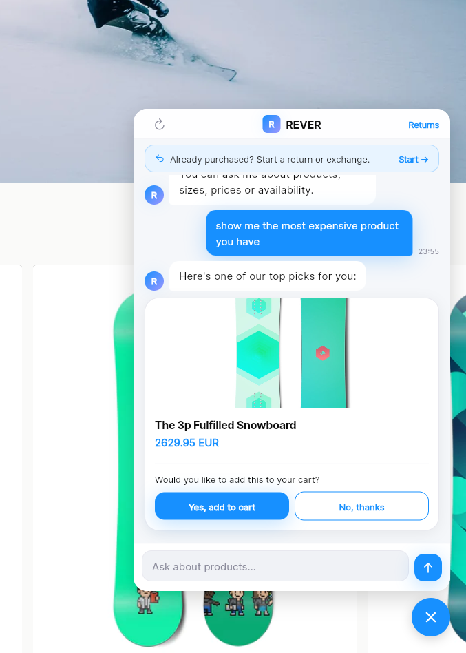
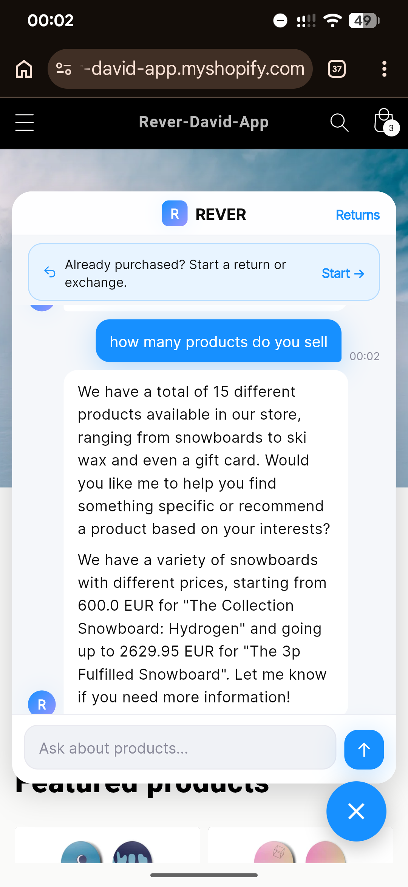
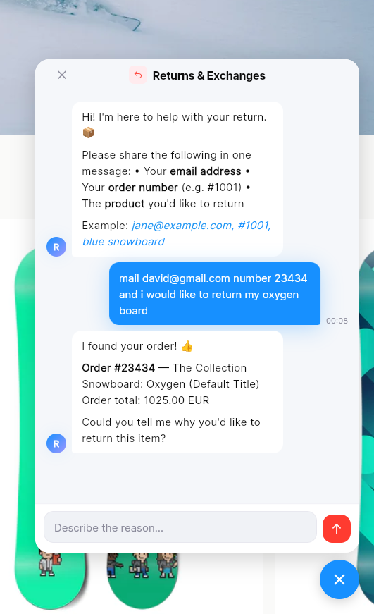
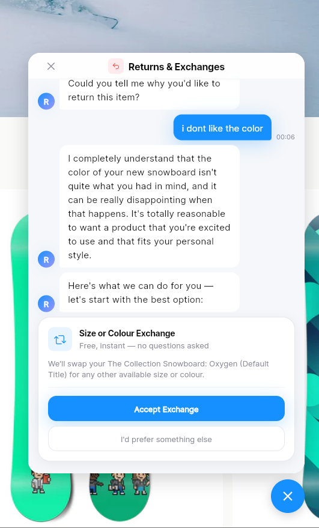
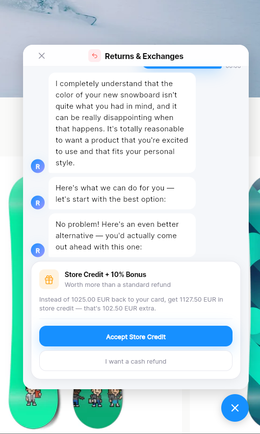
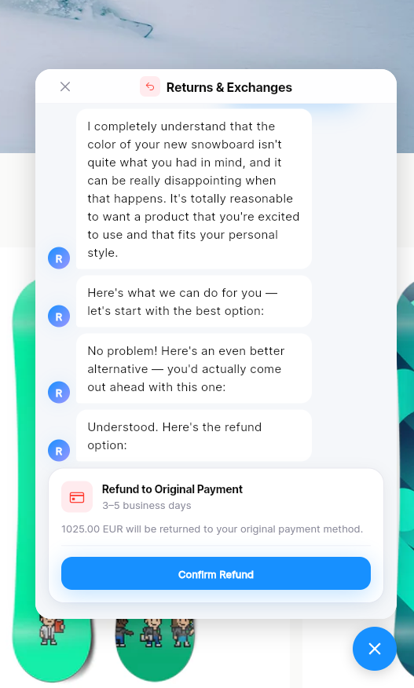
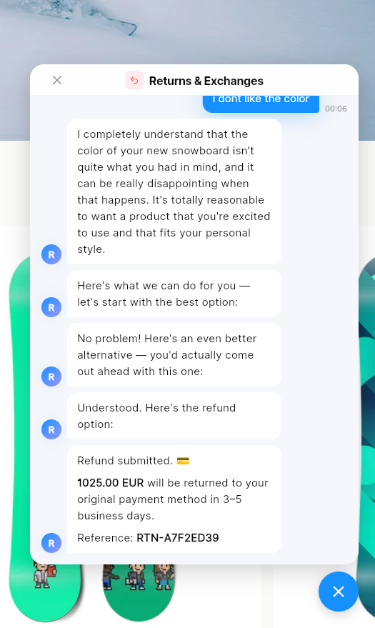

# REVER – Shopify AI Chatbot

An AI-powered chatbot embedded in a Shopify storefront as a floating widget. It handles two flows:

- **Pre-purchase**: shopping assistant that answers product questions, checks availability, and suggests alternatives using GROQ (Llama 3.3 70B) + Shopify Storefront API.
- **Post-purchase / Returns**: guides customers through return alternatives (exchange → gift card with bonus → refund) before offering a refund, minimising returns.

**Stack:** Flutter Web · Firebase (Auth + Firestore + Hosting) · GROQ / Llama 3.3 70B · Shopify Theme App Extension

---

## Project structure

```
rever/
├── flutter_app/          # Flutter Web chat UI (deployed to Firebase Hosting)
├── rever-chatbot/        # Shopify app (Node.js + Theme App Extension)
│   └── extensions/
│       └── rever-chabot/ # App Embed Block – floating iframe widget
├── firebase.json         # Firebase Hosting config
├── firestore.rules       # Firestore security rules
├── deploy.ps1            # Windows build + deploy script
├── deploy.sh             # macOS / Linux build + deploy script
└── .env.example          # Environment variable template
```

---

## Prerequisites

| Tool | Version | Install |
|------|---------|---------|
| Flutter | ≥ 3.41 | https://docs.flutter.dev/get-started/install |
| Node.js | ≥ 20.19 | https://nodejs.org |
| Firebase CLI | ≥ 15 | `npm install -g firebase-tools` |
| Shopify CLI | ≥ 3.92 | `npm install -g @shopify/cli` |

---

## Setup

### 1. Clone and configure environment

```bash
git clone https://github.com/Dakuur/rever
cd rever
cp .env.example .env
```

Edit `.env` and fill in all values (see comments in the file for where to find each key).

```bash
cp rever-chatbot/.env.example rever-chatbot/.env
```

Edit `rever-chatbot/.env` with the Shopify app credentials.

### 2. Firebase

Log in and select the project:

```bash
firebase login
firebase use rever-c494a
```

Deploy Firestore rules:

```bash
firebase deploy --only firestore:rules
```

### 3. Flutter dependencies

```bash
cd flutter_app
flutter pub get
cd ..
```

### 4. Build and deploy Flutter Web

**Windows:**
```powershell
.\deploy.ps1
```

**macOS / Linux:**
```bash
chmod +x deploy.sh
./deploy.sh
```

This reads keys from `.env`, builds Flutter Web, and deploys to Firebase Hosting at `https://rever-c494a.web.app`.

### 5. Shopify extension

```bash
cd rever-chatbot
npm install
shopify app deploy
```

This deploys the Theme App Extension to Shopify Partners.

### 6. Install the app on the dev store

Go to [Shopify Partners](https://partners.shopify.com) → Apps → **Rever Chatbot** → **Test your app** → select the dev store → install.

### 7. Activate the widget in the theme

1. Go to Shopify Admin → Online Store → Themes → **Customize**
2. In the left panel, click **App embeds**
3. Toggle **REVER Chat** on → **Save**

The floating chat bubble will now appear on all storefront pages.

---

## Testing

### Run unit tests (Flutter – VM)

```bash
cd flutter_app
flutter test test/models/ test/services/ test/config/
```

### Run widget tests (Flutter – requires Chrome)

```bash
cd flutter_app
flutter test test/widgets/ --platform chrome
```

### Run Node.js / Shopify app tests

```bash
cd rever-chatbot
npm test
```

**216 Flutter unit tests** cover models, services, config, and localisation across 7 languages. **43 Node.js tests** cover webhook handlers, Prisma singleton, the Liquid extension, and the app TOML config. Widget tests cover chat bubbles, product cards, and the incentive ladder.

The deploy scripts (`deploy.ps1` / `deploy.sh`) run the Flutter and Node.js unit tests automatically before building; a failing test aborts the deploy. CI runs the full suite (including Chrome widget tests) on every push via `.github/workflows/tests.yml`.

---

## Development

To run the Flutter app locally:

```bash
cd flutter_app
flutter run -d chrome \
  --dart-define=GROQ_API_KEY=your_groq_key \
  --dart-define=SHOPIFY_STORE_DOMAIN=yourstore.myshopify.com \
  --dart-define=SHOPIFY_STOREFRONT_TOKEN=your_token
```

To run the Shopify app locally (requires the app to be installed first):

```bash
cd rever-chatbot
shopify app dev
```

---

## How it works

```
Shopify storefront
  └── App Embed Block (rever-chat.liquid)
        └── iframe → https://rever-c494a.web.app
              └── Flutter Web app
                    ├── GeminiService  → GROQ / Llama 3.3 70B (AI responses)
                    ├── ShopifyService → Storefront GraphQL API (product data)
                    └── FirebaseService → Firestore (session + return request logs)
```

All API keys are injected at Flutter build time via `--dart-define` and are never stored in source code.

### Order number validation

Before proceeding with the return flow, the app calls a Firebase Cloud Function (`verifyOrderNumber`) written in JavaScript. The function receives the order number and checks whether it is a prime number, returning `{ isValid: bool, orderId: string }`. Only prime order numbers are accepted (e.g. 1031, 1033, 1039). This is a simulation of a real order validation check against a backend database — in a production app the same function would query Shopify's Orders API instead.

## Future improvements / Known limitations

- Multi-model support: Dynamically switch between different AI models based on query type (e.g. smaller model for simple FAQs, larger model for complex queries).
- Slow load times: Flutter Web is heavy, leading to slow initial load. Consider a lighter frontend framework or optimizing Flutter build.
- Better AI model: Models as Gemini 2.5 flash are available for free, but limited to a few requests per day. A paid API key for a more powerful model (e.g. Gemini 3.3) would improve response quality and allow more interactions.
- More robust return flow: The current return flow is basic and could be expanded with more options (e.g. schedule a pickup, better handling of edge cases like partial refunds, damaged items, etc.).
- Real order validation: The Cloud Function currently uses a prime number check as a stand-in for real order verification. Integrating with Shopify's Orders API would replace this with actual order lookups.
- Product handling fixes: The model often recommends sold out products, or can't detect sales and discounts. Better integration with the Shopify API and more robust prompt engineering could help with this.
- Real e-mail sending: The app currently simulates sending return confirmation emails. Integrating a real email service would make the return flow more realistic and functional.

## Activity log

| Activity                                                                               | Work hours | Cummulative hours |
|----------------------------------------------------------------------------------------|------------|-------------------|
| Initial research, reading documentation and tutorials and planning using Google Gemini | 1.5        | 1.5               |
| Shopify profile, shop, app and Storefront API creation (Shopify website)               | 1          | 2.5               |
| Firebase, Gemini API creation and configuration                                        | 1          | 3.5               |
| First implementation (Using Claude Code) with Flutter                                  | 1          | 4.5               |
| UI bugfix, AI model switch to GROQ (Llama), and minor implementations (session cookie) | 1          | 5.5               |
| Model context fixes, provide model with more info.                                     | 0.5        | 6                 |
| UI redesign, alligned with Rever colors and overall style                              | 0.5        | 6.5               |
| Add to cart suggestion and refund flow upgrade. Added multi-language support           | 1          | 7.5               |
| Documenting and deploy fixing for easy app deployment recreation                       | 0.5        | 8                 |
| Added tests and Order Number verification in Firebase in the return flow               | 0.5        | 8.5               |

## Screenshots

<div style="display:flex; gap:12px;">
  
  
</div>

### Return flow example

<div style="display:flex; gap:12px; flex-wrap:wrap;">
  
  
  
  
  
</div>

